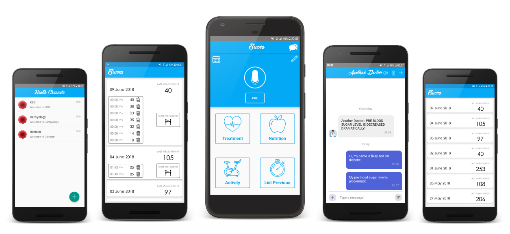

# Sucre

## MESSAGE TRANSFER SERVER

Sucre is a diabetes application which has several features for diabetics that make their life easy. It’s a mobile platform which has an Android application and a backend server which keep data and run anomaly detection thread. The platform requires internet connection since the data is saved on cloud and anomaly detection process is running on remote server. In addition, Sucre provides an instant messaging service. The messages are transferred via Firebase Cloud Messaging service. 



#### Attention!

This Message Transfer Server is part of [Sucre](https://github.com/ilkayaktas/Sucre) Project. The data is retrieved from [Sucre](https://github.com/ilkayaktas/Sucre) application and saved on MongoDB. So, before you start this server, MongoDB deamon should be run on your PC. Also, you should change server address on [application.properties](./src/main/resources/application.properties) file.

```groovy
server.address=192.168.1.26
```

You can find detailed article in [Medium](https://medium.com/@ilkayaktas/why-did-i-build-a-diabetes-management-platform-10e7423b8e82).

